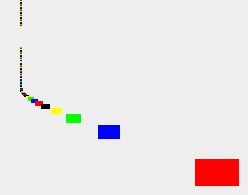

# Advent of code 2021

https://adventofcode.com/2021

## Setup

You need `nvm` and `npm` installed. Run:

    nvm install
    npm install

And that's it.

## Run

For each challenge being developed, run:

    npm start <day>

For example, `npm start 03a`. This will start Webpack in watch mode, rebuilding the script on every change and running it again right after.

If you want to run the challenge independently, make sure `npm start <day>` is still running (so that the compiler kicks in) and run:

    npm run latest

Which will run the latest build once and stop.

## Debug

In WebStorm, run the intended script in the `dist` folder, but add your breakpoints to the TypeScript file in the `src` folder. It should work just fine.

## Byproduct art

